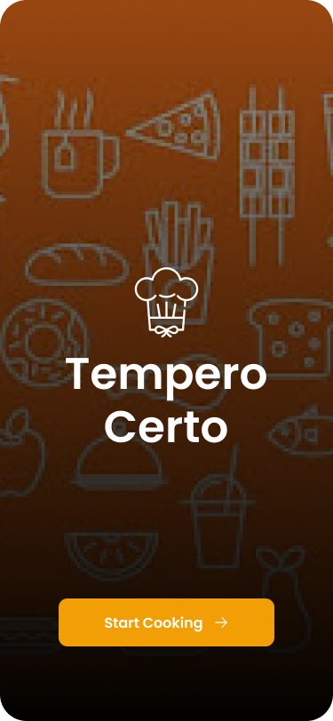
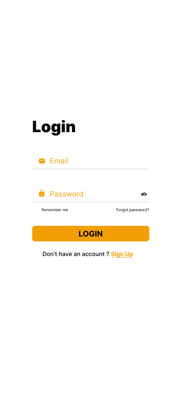
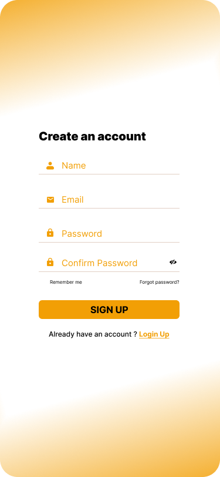
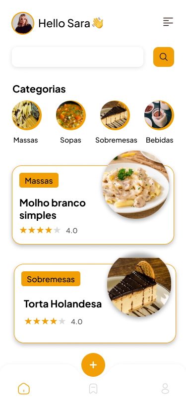
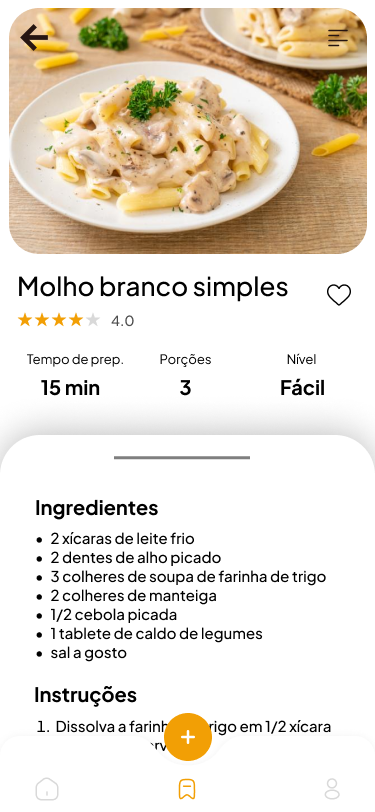
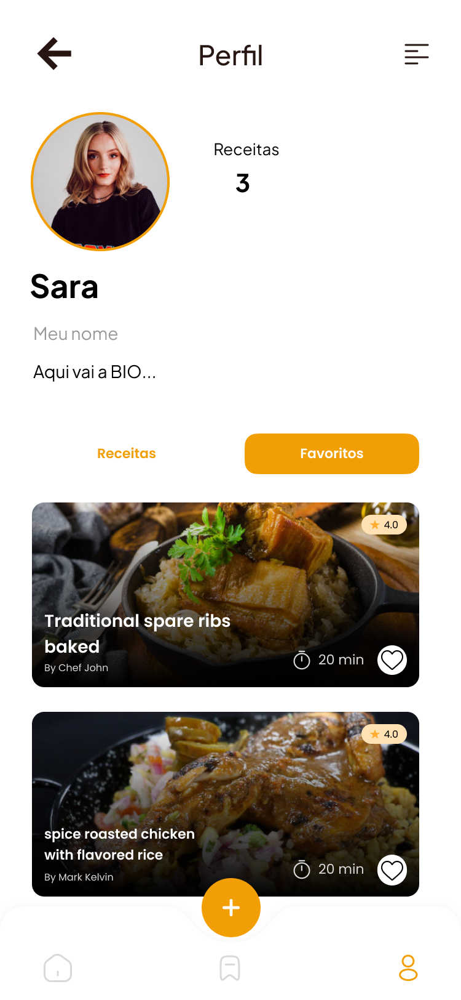
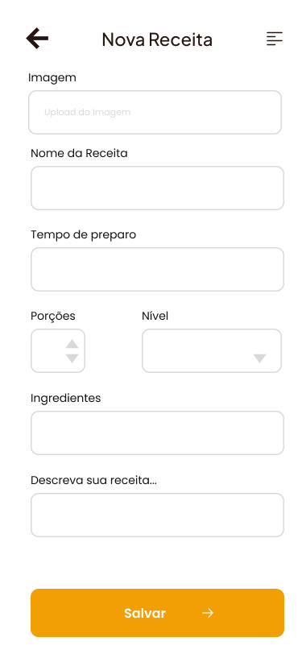

# App Tempero Certo

Este projeto foi desenvolvido para a discplina de Desenvolvimento Mobile da minha faculdade, onde eu e meu grupo criamos um app de receitas.

## 🎯 Objetivo

Como proposta principal o app proporcionará uma plataforma interativa onde os usuários poderão descobrir, salvar e avaliar receitas, promovendo uma experiência gastronômica colaborativa e inspiradora.

## 📐 Ferramentas

- Figma (Design e prototipagem)

## 📸 Imagens do Projeto

### 🔄️ Launch Screen

### 🔒 Login e Cadastro
  

### 🏠 Home

### 🍽️ Receita

### 👤 Perfil

### 📝 Cadastro de Receita

## 🔗 Link do Projeto no Figma

[🔗 Ver no Figma](https://www.figma.com/design/YZvIWv4WhXuihJPJ2N163M/App-dev-mobile?node-id=0-1&p=f&t=ylb3mWZOSEC8ALLw-0)

