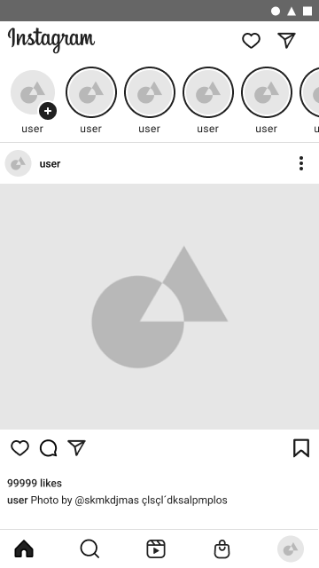
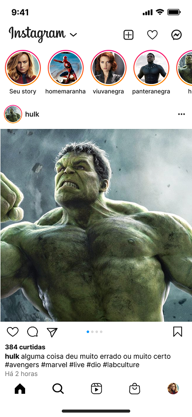

# Live Coding UI/UX – Instagram (DIO)

Este projeto foi desenvolvido durante uma live coding da Digital Innovation One (DIO), com foco em design de interface e experiência de usuário inspirada no Instagram.

<!--
<blockquote>

O Figma é uma das melhores ferramentas online de UI Design, ou seja, de Interface do Usuário.Vamos utilizá-lo para reconstruir a interface do Instagram, aproveitando os principais recursos que o programa oferece, como versionamento automático, painéis de camadas e objetos, bibliotecas de componentes compartilhadas e flows. O Resultado? Telas e fluxos do aplicativo Instagram criados por você e com propostas de melhorias na interface que agreguem na experiência final do usuário.

</blockquote>-->

## 🎯 Objetivo

Criar uma interface moderna e funcional, seguindo boas práticas de UI/UX e com atenção à hierarquia visual, espaçamentos e usabilidade.

## 📐 Ferramentas

- Figma (Design e prototipagem)

## 📸 Imagens do Projeto

### 🔒 Prototipagem Inicial
  

### 🔄️ Launch Screen

### 🏠 Home

## 🔗 Link do Projeto no Figma

[🔗 Ver no Figma](https://www.figma.com/design/dYT05NRFTTHG7mimu79ZLj/Live-Coding-UI-UX-Instagram---DIO?node-id=2-1066&p=f&t=yKSyGcpbfF4fhZY8-0)

